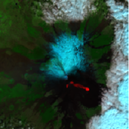

# Rendering Extension Specification

- **Title:** Rendering
- **Identifier:** <https://stac-extensions.github.io/render/v1.0.0/schema.json>
- **Field Name Prefix:** rdr
- **Scope:** Item, Collection
- **Extension [Maturity Classification](https://github.com/radiantearth/stac-spec/tree/master/extensions/README.md#extension-maturity):** Proposal
- **Owner**: @emmanuelmathot

This document explains the Template Extension to the [SpatioTemporal Asset Catalog](https://github.com/radiantearth/stac-spec) (STAC) specification.

Rendering extension aims at providings consumers with the information required to view an asset properly (e.g. on a online map)

- Examples:
  - [Landsat-8 example](examples/item-landsat8.json): Shows the basic usage of the extension in a landsat-8 STAC Item
- [JSON Schema](json-schema/schema.json)
- [Changelog](./CHANGELOG.md)

## Fields

The fields in the table below can be used in these parts of STAC documents:

- [ ] Catalogs
- [ ] Collections
- [ ] Item Properties (incl. Summaries in Collections)
- [x] Assets (for both Collections and Items, incl. Item Asset Definitions in Collections)
- [ ] Links

| Field Name        | Type   | Description                                                                                                                                  |
| ----------------- | ------ | -------------------------------------------------------------------------------------------------------------------------------------------- |
| rdr:colormap_name | string | Color map identifier that must be applied for a raster band                                                                                  |
| rdr:colormap      | object | [Color map JSON definition](https://developmentseed.org/titiler/advanced/rendering/#custom-colormaps) that must be applied for a raster band |
| rdr:color_formula | string | [Color formula](https://developmentseed.org/titiler/advanced/rendering/#color-formula) that must be applied for a raster band                |
| rdr:minmax_zoom   | \[int] | Zoom levels range applicable for the visualization                                                                                           |

## Dynamic tile servers integration

Dynamic tile servers could exploit the information in the `rendering` extension to automatically produce RGB tiles
from asset bands using their parameters.

### Titiler

[titiler](https://github.com/developmentseed/titiler) offers a native
[STAC reader](https://github.com/developmentseed/titiler/blob/main/docs/src/endpoints/stac.md).

Then it can easily be used to produce RGB tiles from a STAC Item with the values in the `rendering` and [`virtual-assets`](https://github.com/stac-extensions/virtual-assets) extension.

The following table describes the titiler query parameters that could be used and the corresponding extension fields.

Either the client building titiler url can use the information in the virtual asset to build the query parameters
or the dynamic tile server could use the information in the virtual asset to build the query parameters
by simply specifying the `url` and `assets` query parameters.

| Query key       | field                                   | Description                                                                                                                                                                                                                                                                         |
| --------------- | --------------------------------------- | ----------------------------------------------------------------------------------------------------------------------------------------------------------------------------------------------------------------------------------------------------------------------------------- |
| `url`           | `href` in item self link                | STAC Item URL                                                                                                                                                                                                                                                                       |
| `assets`        | `vrt:hrefs` or asset key                | For a local composition (asset in the same item), the assets key can be retrieved from the vrt:hrefs and joined with comma (e.g. `B04,B03,B02`. Titiler may support to specify directly the virtual asset key and set internally all the parameters according to the current table. |
| `rescale`       | `vrt:rescale`                           | Delimited Min,Max bounds defined in `vrt:rescale` field                                                                                                                                                                                                                             |
| `expression`    | `vrt:algoritm` and `vrt:algoritm_opts`  | Band arithmetic formula as defined in field `vrt:algoritm_opts`.`expression` if `vrt:algorithm` is set to `band_arithmetic`                                                                                                                                                         |
| `nodata`        | `vrt:nodata` or `nodata` `raster:bands` | Nodata value defined in `nodata` field of the corresponding `raster:bands` item                                                                                                                                                                                                     |
| `unscale`       | `scale` and `offset` in `raster:bands`  | Scale and Offset value defined in `scale` and `offset` fields of the corresponding `raster:bands` item                                                                                                                                                                              |
| `colormap_name` | `rdr:colormap_name`                     | Color map name defined in `rdr:colormap` field of the `asset`                                                                                                                                                                                                                       |
| `colormap`      | `rdr:colormap`                          | Color map JSON definition as defined in `rdr:colormap` object of the `asset` (overrides `colormap_name` if present )                                                                                                                                                                |
| `color_formula` | `rdr:color_formula`                     | Color formula as defined in `rdr:color_formula` field of the `asset`                                                                                                                                                                                                                |
| `resampling`    | `rdr:resampling`                        | Resampling method to use when reprojecting the raster.                                                                                                                                                                                                                              |

#### Shortwave Infra-red visual thermal signature example

From the [Sentinel-2 item](https://github.com/stac-extensions/virtual-assets/blob/main/examples/item-sentinel2.json):

```json
"assets":{
  "sir":
  {
    "roles": [ "overview", "virtual" ],
    "title": "Shortwave Infra-red",
    "vrt:hrefs": [ 
      "https://raw.githubusercontent.com/stac-extensions/raster/main/examples/item-sentinel2.json#B12",
      "https://raw.githubusercontent.com/stac-extensions/raster/main/examples/item-sentinel2.json#B8A",
      "https://raw.githubusercontent.com/stac-extensions/raster/main/examples/item-sentinel2.json#B04"
    ],
    "vrt:rescale": [[0,5000],[0,7000],[0,9000]]
  }
}
```

| Query key | value                                                             | Example value                                                                                |
| --------- | ----------------------------------------------------------------- | -------------------------------------------------------------------------------------------- |
| url       | STAC Item URL                                                     | `https://raw.githubusercontent.com/stac-extensions/raster/main/examples/item-sentinel2.json` |
| assets    | Assets keys defined in the `bands` objects with field `asset_key` | `B12,B8A,B04`                                                                                |
| rescale   | Delimited Min,Max bounds defined in `vrt:rescale` field           | `0,5000,0,7000,0,9000`                                                                       |

URL: `https://api.cogeo.xyz/stac/crop/14.869,37.682,15.113,37.862/256x256.png?url=https://raw.githubusercontent.com/stac-extensions/raster/main/examples/item-sentinel2.json&assets=B12,B8A,B04&resampling_method=average&rescale=0,5000,0,7000,0,9000&return_mask=true`

**Result**: Lava thermal signature of Mount Etna eruption (February 2021)



#### Normalized Difference Vegetation Index (NDVI) example

From the [Landsat-8 example](examples/item-landsat8.json) \[[article](https://www.usgs.gov/core-science-systems/nli/landsat/landsat-normalized-difference-vegetation-index?qt-science_support_page_related_con=0#qt-science_support_page_related_con)]:

```json
"assets":{
  "ndvi": 
  {
    "roles": [ "virtual", "data", "index" ],
    "virtual:hrefs": [ "#/assets/B04", "#/assets/B05" ],
    "title": "Normalized Difference Vegetation Index",
    "vrt:algorithm": "band_arithmetic",
    "vrt:algorithm_opts": {
      "expression": "(B05–B04)/(B05+B04)"
    },
    "vrt:rescale": [[-1,1]],
    "rdr:colormap_name": "ylgn"
  }
}
```

| Query key  | value                                                   | Example value                                                                               |
| ---------- | ------------------------------------------------------- | ------------------------------------------------------------------------------------------- |
| url        | STAC Item URL                                           | `https://raw.githubusercontent.com/stac-extensions/raster/main/examples/item-landsat8.json` |
| rescale    | Delimited Min,Max bounds defined in `vrt:rescale` field | `-1,1`                                                                                      |
| expression | Band math formula as defined in field `vrt:algorithm`   | `(B5–B4)/(B5+B4)`                                                                           |
| colormap   | Color map JSON definition as defined in `rdr:colormap`  | `ylgn`                                                                                      |

URL:

`https://api.cogeo.xyz/stac/preview.png?url=https://raw.githubusercontent.com/stac-extensions/raster/main/examples/item-landsat8.json&expression=(B5–B4)/(B5+B4)&max_size=512&width=512&resampling_method=average&rescale=-1,1&color_map=ylgn&return_mask=true`

Result:  Landsat Surface Reflectance Normalized Difference Vegetation Index (NDVI) path 44 row 33.

/(B5+B4)&max_size=512&width=512&resampling_method=average&rescale=-1,1&color_map=ylgn&return_mask=true)

## Links

It is highly suggested to have a web map link in the `links` section of the STAC Item as described in the [Web Map Link extension](https://github.com/stac-extensions/web-map-links) to allow consumers to easily visualize the asset.

## Contributing

All contributions are subject to the
[STAC Specification Code of Conduct](https://github.com/radiantearth/stac-spec/blob/master/CODE_OF_CONDUCT.md).
For contributions, please follow the
[STAC specification contributing guide](https://github.com/radiantearth/stac-spec/blob/master/CONTRIBUTING.md) Instructions
for running tests are copied here for convenience.

### Running tests

The same checks that run as checks on PR's are part of the repository and can be run locally to verify that changes are valid. 
To run tests locally, you'll need `npm`, which is a standard part of any [node.js installation](https://nodejs.org/en/download/).

First you'll need to install everything with npm once. Just navigate to the root of this repository and on 
your command line run:
```bash
npm install
```

Then to check markdown formatting and test the examples against the JSON schema, you can run:
```bash
npm test
```

This will spit out the same texts that you see online, and you can then go and fix your markdown or examples.

If the tests reveal formatting problems with the examples, you can fix them with:
```bash
npm run format-examples
```
